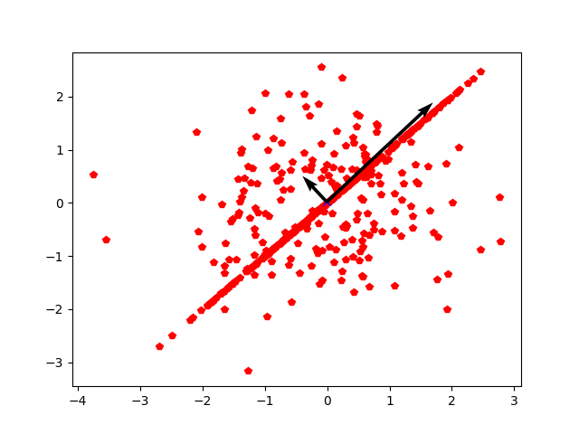

# simplePCA

### About

Simple Principal Component Analysis implementation with python and numpy. Input data can be i.e. 2D or a 3D array (reshaped binary image or a 3D point cloud). Can be used for data dimensionality reduction in machine learning applications or to find the dimension in a multi-dimensional data wich contains most of the information. 

 
</a>
</a>

### How to use
Provide an input array of shape (N,2) or (N,3) the function will return the mean (center point), eigenvector and eigenvalues. Take a look in the test file for usage.

/Enjoy